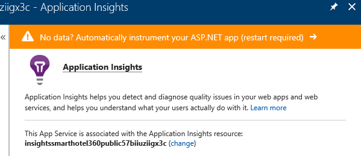

# Azure Functions & Web App Service Demo Setup

In order to run through the [demo scripts in this repo](../DemoScripts) you will need to set up your own environment. 

There are two demos that show the power of .NET Core, Visual Studio and Azure. The first one demonstrates the ability to easily develop and debug C# Azure Functions in Visual Studio 2017. This demo shows how the hotel only allows dogs by asking the customer to upload a picture of their pet.

The second demo shows how Application Insights is automatically configured and monitoring the health of your .NET Core apps in Azure App Service. It also shows how to debug production exceptions with the new snapshot debugging. 

In order to show these demos, you need to have the services deployed to your own Azure subscription. The step-by-step demo scripts are available here:
* [Azure Functions Local Debugging](../DemoScripts/AzureFunctionsNETCoreDebugging.pdf)
* [App Service Production Debugging & Application Insights](../DemoScripts/ProductionNETCoreDebugging.pdf)

## Creating The Azure Resources

The first step is to create the needed Azure resources: The Azure Function, the Blob Storage (for storing the pets images), the Cosmos DB (stores documents with the pet information), the Vision API, SignalR Service and for the website the App Service, Service Plan and Application Insights. 

To create these resources we have the following ARM template:

<a href="https://portal.azure.com/#create/Microsoft.Template/uri/https%3A%2F%2Fraw.githubusercontent.com%2FMicrosoft%2FSmartHotel360-Website%2Fmaster%2FSource%2FSmartHotel360.WebsiteARM%2Fsmarthote360.website.deployment.json?target=_blank" target='_blank'></a>

Once the resources are created you need to do some manual steps:

1. Create a blob storage container called `pets` in the storage account and ensure it has public access


2. [Create a database](https://docs.microsoft.com/en-us/azure/cosmos-db/create-sql-api-dotnet#add-a-collection) called `pets` in Cosmos DB. Then add a collection called `checks`.


## Setting Up The Website with the Function

When the website starts up, it looks for the `SettingsUrl` in the `appsetting.json` file. This variable must contain an URL to a configuration file. By default, the setting used is a public endpoint. If you want change the values you can do it in the `Production` if you are using a `Release `configuration or `Development` if you are using a `Debug` configuration.

* Open the file `appsettings.Development.json` or `appsettings.Production.json` according to your Build configuration. Then edit the `PetsConfig` section with the desired values:

  * `blobName`: The name of the storage account
  * `blobKey`: The [key to the storage account](https://docs.microsoft.com/en-us/azure/storage/common/storage-create-storage-account#manage-your-storage-account)
  * `cosmosUri`: The [uri of the Cosmos DB](https://docs.microsoft.com/en-us/azure/cosmos-db/create-sql-api-dotnet#update-your-connection-string) created (i.e. `https://xxxxx.documents.azure.com:443/`)
  * `cosmosKey`: The key of the Cosmos DB created
  * `api`: The URL of your Azure Function

## Deploying the Website to Azure App Service

Once the resources and settings are created, you can publish the website to App Service. First, enable Application Insights monitoring by selecting Application Insights tab on the App Service and clicking on the banner.



In Visual Studio 2017 select the Website project in the Solution Explorer and use the quick search bar for "Add Application Insights". Select "Start Free", then choose "existing resource". Select the Application Insights resource associated with the App Service. 

Now you can publish the website to App Service using the [Visual Studio 2017 Publish feature](https://docs.microsoft.com/en-us/aspnet/core/tutorials/publish-to-azure-webapp-using-vs#deploy-the-app-to-azure). Just select "Existing App Service" and specify your resource group.

## Run the Azure Function locally

To run the Azure Function locally you can use Visual Studio 2017 15.5 or higher and start debugging the Azure Function project (`WebsiteFunction`). Make sure to edit the `local.settings.json` file with the values of your environment first:

```
{
  "IsEncrypted": false,
  "Values": {
    "AzureWebJobsStorage": "PUT STORAGE CONNECTION STRING",
    "AzureWebJobsDashboard": "",
    "cosmos_uri": "https://your-cosmosdb-uri-here.documents.azure.com:443/",
    "cosmos_key": "PUT YOUR COSMOSDB KEY HERE",
    "constr": "PUT YOUT COSMOSDB CONNECTION STRING AccountEndpoint=....;",
    "MicrosoftVisionApiKey": "PUT YOUR VISION API KEY HERE",
    "MicrosoftVisionApiEndpoint": "PUT YOUR API ENDPOINT HERE (i.e. https://eastus.api.cognitive.microsoft.com/vision/v1.0/)",
    "MicrosoftVisionNumTags": "10"
  }
}
```

Now, you should be able to run both the function and the azure function locally and debug it. If it is not working ensure that the configuration is correct. If the Azure Function is not triggered be sure that:

1. The [blob container has public access](https://docs.microsoft.com/en-us/azure/storage/blobs/storage-manage-access-to-resources).
2. The `local.settings.json` file contains the correct `cosmos_uri`, `cosmos_key` and `constr` values
3. The website uses the correct configuration settings from `SettingsUrl`. It should save the images in a blob container called `pets` in your storage. It should also create documents in a collection called `checks` in a database `pets`. You can verify this using the Data Explorer. Be sure that the both database and collection exists on Cosmos DB:


## Deploying the Function to Azure

Once you have the Function app running locally per above instructions, you can use the [Visual Studio 2017 Publish feature to publish the Azure Function](https://docs.microsoft.com/en-us/azure/azure-functions/functions-develop-vs#publish-to-azure).  Select publish to an existing Function App and specify your resource group. 

The function will NOT be published with values of the `local.settings.json` file. You need to add these keys manually in the publish wizard the first time you publish. 


