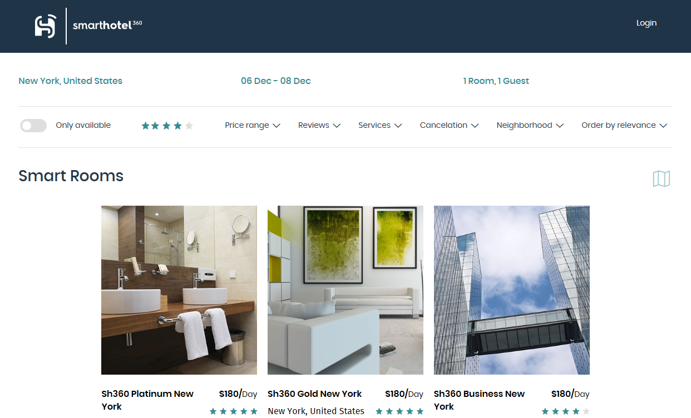
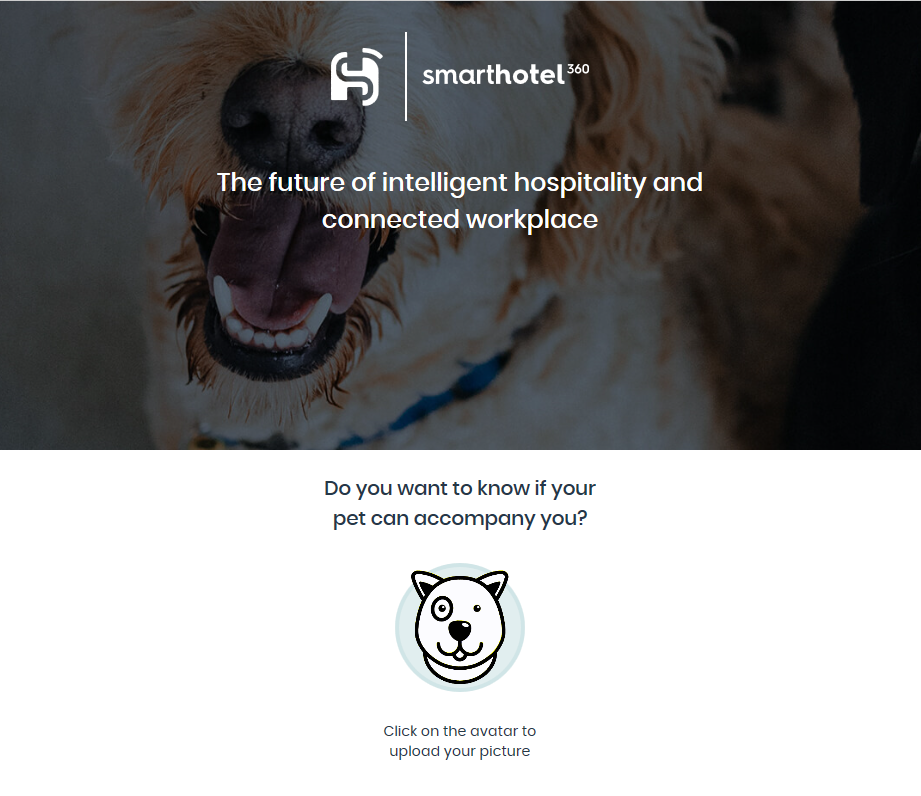
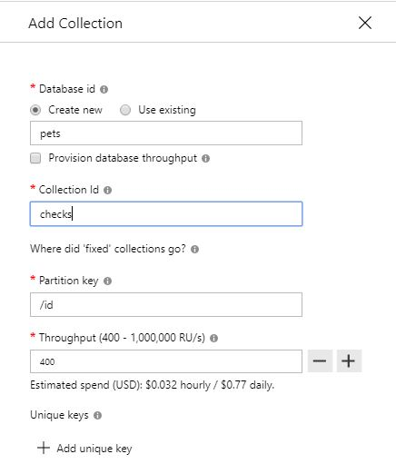
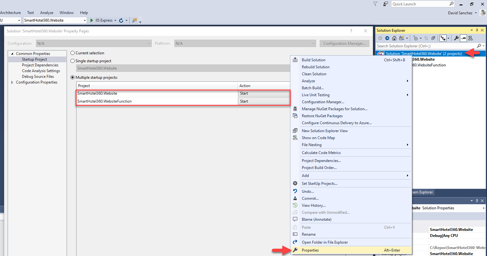

# **The project SmartHotel360 have been retired, we have archived it. It is no longer maintained. You still can fork the repository.**

## For the latest sample references visit: https://aka.ms/tailwindtraders & https://aka.ms/rpsls 

# SmartHotel360

We are happy to announce the release of SmartHotel360. This release intends to share a simplified version of SmartHotel360 reference sample apps used at Connect(); 2017 Keynotes. If you missed it, you can watch <a href="https://channel9.msdn.com/Events/Connect/2017/K100">Scott Guthrie’s Keynote: Journey to the Intelligent Cloud in Channel 9</a>.

We updated the code for this repository to support Scott Hanselman's General Session from Ignite 2018, [An end-to-end tour of the Microsoft developer platform](https://myignite.techcommunity.microsoft.com/sessions/66696#ignite-html-anchor). 

# SmartHotel360 Repos
For this reference app scenario, we built several consumer and line-of-business apps and an Azure backend. You can find all SmartHotel360 repos in the following locations:

- [SmartHotel360](https://github.com/Microsoft/SmartHotel360)
- [IoT](https://github.com/Microsoft/SmartHotel360-IoT)
- [Mixed Reality](https://github.com/Microsoft/SmartHotel360-MixedReality)
- [Backend](https://github.com/Microsoft/SmartHotel360-Backend)
- [Website](https://github.com/Microsoft/SmartHotel360-Website)
- [Mobile](https://github.com/Microsoft/SmartHotel360-Mobile)
- [Sentiment Analysis](https://github.com/Microsoft/SmartHotel360-SentimentAnalysis)
- [Registration](https://github.com/Microsoft/SmartHotel360-Registration)

# SmartHotel360 - Website
Welcome to the repository containing the website of SmartHotel360. SmartHotel360 has multiple apps that share a common backend, including a public website where hotel guests can book a room, smart conference rooms, and even verify if their pets are allowed in the hotel.

[](https://dev.azure.com/smarthotel360/Website/_build/latest?definitionId=28)




# Getting Started

Once downloaded you can open the `SmartHotel360.WebSite.sln` file, located in the Source folder to open the solution in Visual Studio 2017 15.5 or higher. This solution contains two projects:

* The SmartHotel360.Website project: An [ASP.NET Core](www.dot.net) website which is a web app developed using React+Redux and server-side rendering.

* The SmartHotel360.WebsiteFunction project: An [Azure Function](https://azure.microsoft.com/services/functions) used to analyze photos of pets using the Cognitive Services Vision API and Azure Cosmos DB.

> Note: You will need NodeJS installed and Azure CLI in order to run the solution locally.

# Deploy to Azure

We will need an Azure Function (for the pet checker feature), Blob Storage (for storing the pets images), Cosmos DB (stores documents with the pet information), Vision API (to recognize the pets), SignalR Service (to manage the requests), App Service (for the website) and  Application Insights (for monitoring). 

We have added an Azure Resource Manager Template so you can automate the creation of these resources:

[](https://portal.azure.com/#create/Microsoft.Template/uri/https%3A%2F%2Fraw.githubusercontent.com%2FMicrosoft%2FSmartHotel360-Website%2Fmaster%2FDeploy%2Fdeployment.json)

> Note: Some Azure resources are needed even if you want to run the Function locally.

Once the resources are created you will need to follow a couple of manual steps:

1. Create a blob storage container called `pets` in the storage account and ensure it has public access.


2. [Create a database](https://docs.microsoft.com/en-us/azure/cosmos-db/create-sql-api-dotnet#add-a-collection) in the CosmosDB called `pets`. Then add one collections called `checks`.



# Running the Solution Locally

Set `SmartHotel360.Website` as startup project, then hit F5 to start debugging. The web is configured to use the public endpoints for the backend, so you don't need to run the backend locally.

## Configuring the Website

The file `appsettings.Development.json` contains the settings of the website. By default, the following options are used:

* `SettingsUrl`: URL of the configuration endpoint. By default, it uses the public endpoint service. Change this value if you have deployed the [Backend Services](https://github.com/Microsoft/SmartHotel360-Backend) and want to use your own backend.
* `FakeAuth`: Contains data to "simulate" the login process. Data is `Name` (name of the user), `UserId` (id of the user), `PicUrl` (URL of the user avatar).

> If `FakeAuth` is **not set** the Website will use an [Azure Active Directory B2C](https://github.com/Microsoft/SmartHotel360-Website#enabling-azure-ad-b2c-optional) to enable the logins.

If you want to run or deploy the Azure Function to enable the Pet Checker feature open the file `appsettings.Development.json` or `appsettings.Production.json` according to your Build configuration, `Production` if you are using a `Release` configuration or `Development` if you are using a `Debug` configuration. Then edit the `PetsConfig` section with the following entries:

* `blobName`: Storage Account Name
* `blobKey`: Storage Account Key
* `cosmosUri`: URL to Cosmos DB Document Store (eg. https://petpictureuploadmetadata.documents.azure.com:443/)
* `cosmosKey`: Cosmos DB Key
* `api`: URL to Azure Function (eg. http://petchecker.azurewebsites.net)

## Configuring the Azure Function

Open the project `SmartHotel360.WebsiteFunction` and edit the `local.settings.json` file with following entries:

* `AzureWebJobsStorage`: Storage Account Connection String
* `AzureWebJobsDashboard`: Storage Account Connection String
* `cosmos_uri`: Cosmos DB (SQL API) URL (eg. https://petpictureuploadmetadata.documents.azure.com:443)
* `cosmos_key`: Cosmos DB (SQL API) Key
* `constr`: Cosmos DB (SQL API) Connection String
* `MicrosoftVisionApiKey`: Cognitive Services Vision API Key>
* `MicrosoftVisionApiEndpoint`:Cognitive Services Vision API URL (eg. https://southcentralus.api.cognitive.microsoft.com/vision/v1.0)
* `MicrosoftVisionNumTags`: Tags to fetch from Vision API. For example: 10
* `AzureSignalRConnectionString`: Connection String to the SignalR Service instance

## Running the Website and Function locally

In order to run the Website and the Function locally you will need to setup the `solution` with multiple startup projects:

1. Right click on the solution and then click on properties.
1. Select the option `Multiple startup projects`.
1. Select option `Start` in the `Action` column.



Now, you should be able to run both the Website and the Azure Function locally and debug it. If the Azure Function is not triggered be sure that:

1. The [blob container has public access](https://docs.microsoft.com/en-us/azure/storage/blobs/storage-manage-access-to-resources).
2. The `local.settings.json` file contains the correct `cosmos_uri`, `cosmos_key` and `constr` values.
3. The website uses the correct configuration settings from `SettingsUrl`. It should save the pet images in a blob container called `pets` in your storage. It should also create documents in a collection called `checks` in a database `pets`. You can verify this using the `Data Explorer`. Be sure that the both database and collection exists on Cosmos DB:


# Deploying to Azure

Once the resources and settings are created and configured, you can publish the website to App Service and the Function to Function App Service.

## Deploying the Website to Azure

To deploy the website in Azure you can use the [_Publish_](https://docs.microsoft.com/visualstudio/deployment/quickstart-deploy-to-a-web-site
) button from Visual Studio to deploy to the Azure App Service.

If you deploy the website to an App Service and you disabled the `FakeAuth` to use Azure B2C be sure to go back to FakeAuth because you won't be able to use Azure B2C to login (the redirect URL of your own app service won't be in B2C).

> Note: in productions scenarios we recommend you use [Azure Pipelines](https://azure.microsoft.com/services/devops/pipelines
) for build and releases process.

## Deploying the Function to Azure

You can use the [Visual Studio 2017 Publish feature to publish the Azure Function](https://docs.microsoft.com/azure/azure-functions/functions-develop-vs#publish-to-azure). However the function will not be published with values of the `local.settings.json` file. You need to add these keys manually in the publish wizard the first time you publish.

You can also publish the Function using [`Core Tools`](https://docs.microsoft.com/en-us/azure/azure-functions/functions-run-local#publish) with the following command:

```
func azure functionapp publish <YourFunctionAppName> --publish-local-settings -i
```

> Note: You need to be logged in [`Azure CLI`](https://docs.microsoft.com/cli/azure/authenticate-azure-cli
) in order to run the publish command.

# Enabling Azure AD B2C (Optional)

The website can use [AD B2C](https://azure.microsoft.com/services/active-directory-b2c) for the login process. The external provider configured is "Live ID". If you enable AD B2C logins, you will be able to login with any Live ID Account.

The 1st step to enable AD B2C is **to remove the `FakeAuth` section in the `appsettings.Development.json`**. Then you can run the web and should be able to login to use AD B2C. **Please do not change the port used**: The web must run under `https://localhost:57458`, because this is the redirect URL configured in B2C.

> Note: B2C forces the web to use `https`. Our public backend right now is **not** configured with a SSL certificate, we will be updating the backend endpoints to support SSL soon. At this moment is not possible run the website using B2C with `http`.

# Azure Function & App Service Demo Scripts

There are two demos that show the power of .NET Core, Visual Studio and Azure. In order to run through the [demo scripts](Documents/DemoScripts) you will need to set up your own environment. 

 * The first demo **[Azure Functions Local Debugging](Documents/DemoScripts/AzureFunctionsNETCoreDebugging.pdf)**  demonstrates the ability to easily develop and debug C# Azure Functions in Visual Studio 2017. This demo shows how the hotel only allows dogs by asking the customer to upload a picture of their pet.

* The second demo **[App Service Production Debugging & Application Insights](Documents/DemoScripts/ProductionNETCoreDebugging.pdf)** shows how Application Insights is automatically configured and monitoring the health of your .NET Core apps in Azure App Service. It also shows how to debug production exceptions with the new snapshot debugging.

In order to show these demos, you need to have the services deployed to your own Azure subscription.

# Contributing

This project welcomes contributions and suggestions.  Most contributions require you to agree to a
Contributor License Agreement (CLA) declaring that you have the right to, and actually do, grant us
the rights to use your contribution. For details, visit https://cla.microsoft.com.

When you submit a pull request, a CLA-bot will automatically determine whether you need to provide
a CLA and decorate the PR appropriately (e.g., label, comment). Simply follow the instructions
provided by the bot. You will only need to do this once across all repos using our CLA.

This project has adopted the [Microsoft Open Source Code of Conduct](https://opensource.microsoft.com/codeofconduct/).
For more information see the [Code of Conduct FAQ](https://opensource.microsoft.com/codeofconduct/faq/) or
contact [opencode@microsoft.com](mailto:opencode@microsoft.com) with any additional questions or comments.
