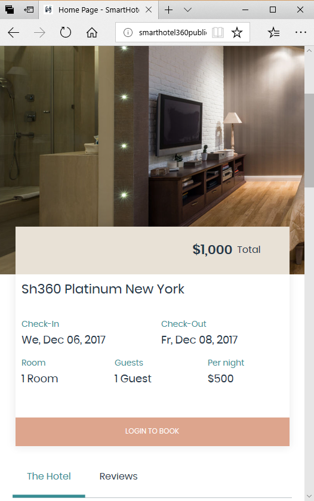
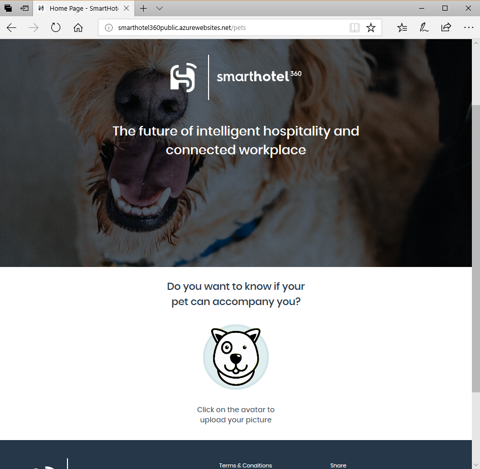
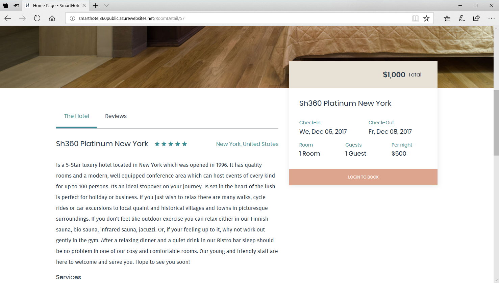

# SmartHotel360 - Public Web 
Welcome to the repository containing the public web site of the SmartHotel360.

# Getting Started

Once downloaded you can open the `SmartHotel360.PublicWebSite.sln` file to open the solution in Visual Studio 2017 15.5 or higher. This solution contains two projects:

* The SmartHotel360.PublicWeb project: An [ASP.NET Core 2.0](www.dot.net) website which is a SPA web app developed using React+Redux and server-side rendering.
* The PetCheckerFunction project: An Azure Function used to analyze photos of pets using the Congnitive Services Vision API and Azure Cosmos DB.

## Screens

## Running the web

Set `SmartHotel360.PublicWeb` as startup project, then hit F5 to start debugging. The web is configured to use the public endpoints for the backend, so you don't need to run the backend locally. 

## Configuring the web

The file `appsettings.Development.json` contains the settings of the web site. By default following options are used:

* `SettingsUrl`: Url of the configuration endpoint. By default it uses the public endpoint service. Only change if you are running your own backend services.
* `AzureFunction`: Url of the Azure Function used to put positive tweets in the home page. Again, by default it uses the public environment so no setup is necessary here.
* `FakeAuth`: Contains data to "simulate" the login process. Data is `Name` (name of the user), `UserId` (id of the user), `PicUrl` (url of the user avatar).

> If `FakeAuth` is **not set** the PublicWeb site uses an Azure Active Directory B2C to enable the logins. Please read "[Enabling B2C logins](./doc/b2c.md)" if you want to use B2C logins.

# Demo Scripts
There is a detailed step-by-step demo script in the [demoscripts](./demoscripts/) folder of this repo that you can use in your own presentations. 

# Contributing

This project welcomes contributions and suggestions.  Most contributions require you to agree to a
Contributor License Agreement (CLA) declaring that you have the right to, and actually do, grant us
the rights to use your contribution. For details, visit https://cla.microsoft.com.

When you submit a pull request, a CLA-bot will automatically determine whether you need to provide
a CLA and decorate the PR appropriately (e.g., label, comment). Simply follow the instructions
provided by the bot. You will only need to do this once across all repos using our CLA.

This project has adopted the [Microsoft Open Source Code of Conduct](https://opensource.microsoft.com/codeofconduct/).
For more information see the [Code of Conduct FAQ](https://opensource.microsoft.com/codeofconduct/faq/) or
contact [opencode@microsoft.com](mailto:opencode@microsoft.com) with any additional questions or comments.
