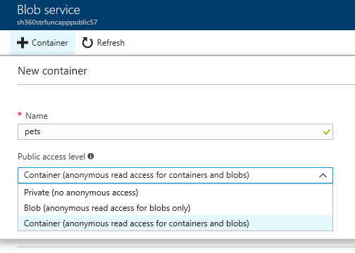
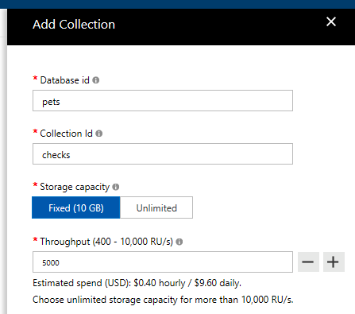

# Azure Functions & Web App Service demo setup

In order to run through the [demo scripts in this repo](../demoscripts) you will need to set up your own environment. 

There are two demos that show the power of .NET Core, Visual Studio and Azure. The first one demonstrates the ability to easily develop and debug C# Azure Functions in Visual Studio 2017. This demo shows how the hotel only allows dogs by asking the customer to upload a picture of their pet. You can view the working demo by accessing [http://smarthotel360public.azurewebsites.net/Pets](http://smarthotel360public.azurewebsites.net/Pets) and uploading a picture of a dog to see it working. The picture is uploaded to Cosmos DB and that triggers an Azure Function to try and recognize the image using the Cognitive Services Vision API. 

The second demo shows how Application Insights is automatically configured and monitoring the health of your .NET Core apps in Azure App Service. It also shows how to debug production exceptions with the new snapshot debugging. 

In order to show these demos, you need to have the services deployed to your own Azure subscription. The step-by-step demo scripts are available here:
* [Azure Functions Local Debugging](demoscripts/AzureFunctionsNETCoreDebugging.pdf)
* [App Service Production Debugging & Application Insights](demoscripts/ProductionNETCoreDebugging.pdf)

## Creating the Azure resources

The first step is to create the needed Azure resources: The Azure Function, the Blob Storage (for storing the pets images), the Cosmos DB (stores documents with the pet information), the Vision API and the App Service for the website. 

To create these resources various ARM scripts are provided in the `/arm` folder:

* `func.json`: ARM script to create the Azure Function, storage, and the Vision API
* `cosmosdb.json`: ARM script for creating the Cosmos DB
* `web.json`: ARM script to create the website App Service and Application Insights. 

You can deploy each ARM script using the deploy.cmd located in the `/arm` folder from a command prompt. Make sure you have the [Azure CLI](https://docs.microsoft.com/en-us/cli/azure/overview?view=azure-cli-latest) installed first.

```
deploy <arm-script> <resource-group-name> [-c location]
```

If parameter `-c` and location are added the resource group is created. So, to deploy the `func.json` ARM script in a new East US resource group named foo, you can type: 

```
deploy func foo -c eastus
```

If `-c` and location are not specified the resource group must already exist. 

>**Note**: The `*.parameters` files contains the parameters for the Azure resources. You should be able to leave them as is. However, keep in mind that some services may not be available for all regions. The East US region supports all the services used here so it is recommended that you create your resource group in that region. 

Once the resources are created you need to do some manual steps:

1. Create a blob storage container called `pets` in the storage account and ensure it has public access



2. [Create a database](https://docs.microsoft.com/en-us/azure/cosmos-db/create-sql-api-dotnet#add-a-collection) called `pets` in Cosmos DB. Then add a collection called `checks`.



## Setting up the web to use your own resources

When the web app starts up, it looks for the `SettingsUrl` app setting. This variable must contain an URL to a configuration file. By default, the setting used is a public endpoint. You need to do the following to change this behavior:

* Copy the file `/config-sample.json/sample.json` (this is a configuration file for the web when using the public endpoint) in a new location. Then edit the `pets_config` section with the desired values:

  * `blobName`: The name of the storage account
  * `blobKey`: The [key to the storage account](https://docs.microsoft.com/en-us/azure/storage/common/storage-create-storage-account#manage-your-storage-account)
  * `cosmosUri`: The [uri of the Cosmos DB](https://docs.microsoft.com/en-us/azure/cosmos-db/create-sql-api-dotnet#update-your-connection-string) created (i.e. `https://xxxxx.documents.azure.com:443/`)
  * `cosmosKey`: The key of the Cosmos DB created

Once you have the file updated **copy it to a public reaching site**. For example, create a new blob container in your storage account and upload the file there using the Azure portal. Be sure that **public access** is allowed. Then update the `SettingsUrl` in the appsettings.*.json to use the URL of your new file. 

```
{
  "Production": false,
  "SettingsUrl": "URL TO CONFIG",
  "FakeAuth": {
    "Name": "Scott Hansleman",
    "PicUrl": "https://pbs.twimg.com/profile_images/459455847165218816/I_sH-zvU_400x400.jpeg",
    "UserId": "ALFKI"
  }
}
```
## Deploying the Website to Azure App Service

Once the resources and settings are created, you can publish the website to App Service. First, 
enable Application Insights monitoring by selecting Application Insights tab on the App Service and clicking on the banner.


In Visual Studio 2017 select the PuiblicWeb project in the Solution Explorer and use the quick search bar for "Add Application Insights". Select "Start Free", then choose "existing resource". Select the Application Insights resource associated with the App Service. 

Now you can publish the website to App Service using the [Visual Studio 2017 Publish feature](https://docs.microsoft.com/en-us/aspnet/core/tutorials/publish-to-azure-webapp-using-vs#deploy-the-app-to-azure). Just select "Existing App Service" and specify your resource group.

Once deployed, update the `SettingsUrl` in the [Application Settings of the App Service](https://docs.microsoft.com/en-us/azure/app-service/web-sites-configure) to use your public endpoint. 

## Run the Azure Function locally

To run the Azure Function locally you can use Visual Studio 2017 15.5 or higher and start debugging the Azure Function project (`PetCheckedFunction`). Make sure to edit the `/PetCheckerFunction/local.settings.json` with the values of your environment first:

```
{
  "IsEncrypted": false,
  "Values": {
    "AzureWebJobsStorage": "PUT STORAGE CONNECTION STRING",
    "AzureWebJobsDashboard": "",
    "cosmos_uri": "https://your-cosmosdb-uri-here.documents.azure.com:443/",
    "cosmos_key": "PUT YOUR COSMOSDB KEY HERE",
    "constr": "PUT YOUT COSMOSDB CONNECTION STRING AccountEndpoint=....;",
    "MicrosoftVisionApiKey": "PUT YOUR VISION API KEY HERE",
    "MicrosoftVisionApiEndpoint": "PUT YOUR API ENDPOINT HERE (i.e. https://eastus.api.cognitive.microsoft.com/vision/v1.0/)",
    "MicrosoftVisionNumTags": "10"
  }
}
```

> **Note** If you have a Function app created (you have one if you used the ARM scripts provided), copy the `AzureWebJobsStorage` value of the Function app here. This is found in the [Application Settings of the Function app](https://docs.microsoft.com/en-us/azure/azure-functions/functions-how-to-use-azure-function-app-settings#settings). If you don't have one, you can use the connection string of the blog storage you created.

Now, you should be able to run both the function and the azure function locally and debug it. If it is not working ensure that the configuration is correct. If the Azure Function is not triggered be sure that:

1. The web uses the correct configurations (it should save the images in a blob container called `pets` in your storage)
2. The [blob container has public access](https://docs.microsoft.com/en-us/azure/storage/blobs/storage-manage-access-to-resources).
3. The `local.settings` file contains correct values
4. The web uses the correct configuration (it should create documents in a collection called `checks` in a database `pets`). You can verify this using the Data Explorer. Be sure that the both database and collection exists on Cosmos DB:


## Deploying the Function to Azure

Assuming you have the Function app running locally per above instructions, you can use the [Visual Studio 2017 Publish feature to publish the Azure Function](https://docs.microsoft.com/en-us/azure/azure-functions/functions-develop-vs#publish-to-azure). The function will be published using the values of the `local.settings` file. You can change these values in the portal.